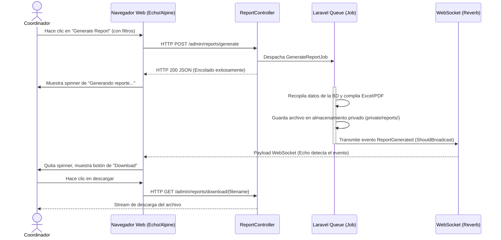

# Flujo de Generación Asíncrona de Reportes (Módulo 8)

Este documento describe la secuencia de eventos técnicos que ocurren cuando un Coordinador de Investigación genera un reporte consolidado en Excel o PDF de forma asíncrona usando Laravel Jobs, Reverb (WebSockets) y Echo.

## Diagrama de Secuencia (Mermaid)

## Flujo de Negocio

1.  **Solicitud Filtrada:** El coordinador entra al panel de reportes e indica los parámetros (ej: período académico 2026-I, facultad de Ingeniería, exportar a PDF).
2.  **Encolamiento del Trabajo:** El servidor procesa la petición de inmediato, crea un identificador único para el reporte, encola el Job y retorna una respuesta JSON rápida.
3.  **Procesamiento Asíncrono:** La cola ejecuta el Job. Esto previene que se caiga la petición HTTP si hay más de 500 registros y la compilación de DomPDF toma más de 30 segundos.
4.  **Aviso WebSocket:** Mediante Laravel Reverb y Laravel Echo en el cliente, el navegador escucha en el canal privado del usuario la finalización del reporte.
5.  **Descarga Segura:** La descarga se realiza mediante un controlador que verifica los permisos del usuario activo sobre el archivo, evitando exposición pública directa de los documentos de auditoría.
