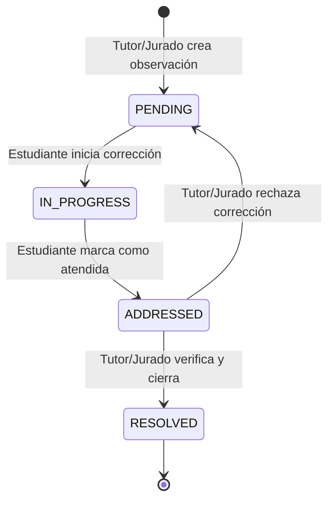

# Flujo de Retroalimentación y Observaciones Estructuradas

Este documento detalla el ciclo de vida de una observación o comentario académico asignado a una sección específica (página y párrafo) de la tesis.

## Diagrama de Flujo (Mermaid)

## Ciclo de Vida de los Comentarios

1.  **PENDING (Pendiente):** El tutor o jurado redacta un comentario señalando una corrección necesaria (ej: "Corregir justificación en pág. 12, párrafo 3"). El estudiante es notificado.
2.  **IN_PROGRESS (En Progreso):** El estudiante marca la observación para indicar que está trabajando en ella.
3.  **ADDRESSED (Atendida):** Una vez hecha la modificación en la tesis y subida la nueva versión del documento, el estudiante marca la observación como "Atendida" y opcionalmente deja una respuesta explicativa.
4.  **RESOLVED (Resuelta / Cerrada):** El tutor o jurado evalúa la nueva versión de la tesis. Si la corrección es correcta, marca el comentario como "Resuelto". Si no es satisfactoria, el estado vuelve a **PENDING** con un nuevo comentario de retroalimentación.
