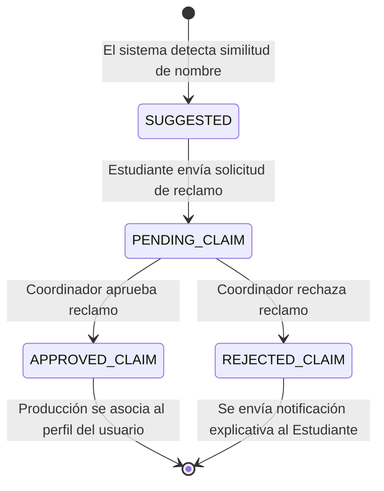

# Flujo de Reclamaciones de Tesis (Claims)

Este documento describe el flujo mediante el cual un estudiante reclama la autoría de una producción científica histórica subida previamente por un administrador o coordinador en texto plano.

## Diagrama de Flujo (Mermaid)

## Pasos del Proceso

1.  **Detección de Coincidencia (SUGGESTED):** Cuando un estudiante inicia sesión, el sistema analiza el catálogo histórico y busca coincidencias fonéticas o textuales entre el nombre del estudiante registrado y los autores en texto plano de las tesis subidas.
2.  **Solicitud de Reclamación (PENDING_CLAIM):** El estudiante ve las sugerencias en su dashboard y hace clic en "Reclamar Autoría", enviando una solicitud formal al panel de coordinación.
3.  **Evaluación de la Coordinación:** El Coordinador de Investigación recibe la solicitud y los datos de identidad. Puede:
    *   **Aprobar (APPROVED_CLAIM):** El sistema crea la relación de base de datos entre el usuario (estudiante) y la producción como autor oficial. Se notifica al estudiante por email.
    *   **Rechazar (REJECTED_CLAIM):** Se deniega la solicitud. El estudiante recibe una notificación con el motivo del rechazo.
