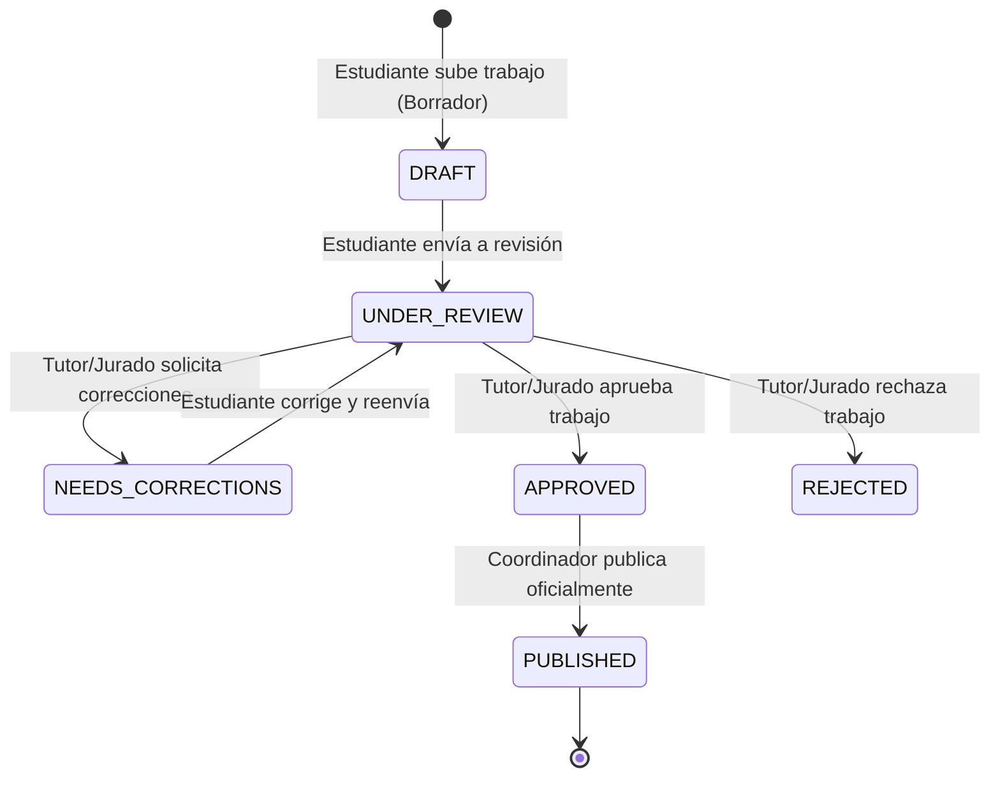

# Flujo de Aprobación de Producción Científica (Tesis)

Este documento detalla el ciclo de vida de una tesis desde su creación inicial como borrador por el estudiante, hasta su aprobación por el jurado/tutor y publicación final por el coordinador.

## Diagrama de Flujo (Mermaid)

## Estados del Flujo (workflow_state)

1.  **DRAFT (Borrador):** El estudiante ha cargado los metadatos y el archivo PDF. Puede modificarlos cuantas veces desee. Aún no es visible para tutores ni coordinadores.
2.  **UNDER_REVIEW (En Revisión):** El estudiante envía el borrador para su evaluación. Queda bloqueado para edición del estudiante. El tutor y jurado reciben notificaciones.
3.  **NEEDS_CORRECTIONS (Requiere Correcciones):** El tutor o jurado encuentra detalles que deben corregirse. Se habilita de nuevo la edición al estudiante para que suba una nueva versión y resuelva observaciones.
4.  **APPROVED (Aprobado):** El tutor y jurado aprueban el trabajo tras evaluar el manuscrito. Pasa a la bandeja del Coordinador de Investigación.
5.  **REJECTED (Rechazado):** El trabajo no cumple los criterios académicos mínimos y es rechazado del proceso.
6.  **PUBLISHED (Publicado):** El Coordinador de Investigación da la aprobación final e indexa el trabajo. Se expone públicamente en el catálogo y queda disponible para cosechadores OAI-PMH.
