# MANUAL DE USUARIO OFICIAL: SKMS-UNIMAR
## Sistema de Gestión del Conocimiento Científico

---

## 1. Introducción y Propósito del Sistema

El **SKMS-Unimar** (Scientific Knowledge Management System) es la plataforma oficial del Decanato de Ingeniería y Afines de la Universidad de Margarita (UNIMAR) destinada a la gestión del ciclo de vida completo de la producción científica institucional.

A diferencia de un repositorio pasivo de archivos, el SKMS-Unimar es un sistema activo basado en flujos de trabajo que guía al estudiante, tutor, jurado y coordinador de investigación a través de cada fase del desarrollo, revisión y publicación de trabajos de grado, tesis e informes de investigación.

### El Ciclo de Vida del Documento
El sistema implementa un motor de estados que condiciona las acciones que cada rol puede realizar sobre un documento:

```
[ Borrador ] --(Enviar)--> [ En Revisión ] --(Aprobar)--> [ Aprobado ] --(Publicar)--> [ Publicado ]
    ^                             |                                                  
    |                             v                                                  
    +---(Correcciones)<-----------+ --(Rechazar)--> [ Rechazado ]                     
```

---

## 2. Roles del Sistema y Matriz de Permisos

El acceso a las funcionalidades del SKMS-Unimar está regulado mediante Roles y Permisos estrictos:

| Rol | Descripción Principal | Permisos Clave |
| :--- | :--- | :--- |
| **Estudiante** | Autor de la investigación. | Crear borrador, subir PDF, responder observaciones, ver progreso personal y línea de tiempo. |
| **Tutor** | Mentor principal del trabajo de grado. | Visualizar PDF asignados, agregar observaciones estructuradas, cambiar estado a *Requiere Correcciones*, *Aprobado* o *Rechazado*. |
| **Jurado** | Evaluadores académicos del documento final. | Visualizar PDF asignados, agregar observaciones y calificar/aprobar el trabajo. |
| **Coordinador** | Responsable de investigación del Decanato. | Validar metadatos (Dublin Core), publicar documentos aprobados, monitorear progreso general, generar reportes de exportación y ver estadísticas. |
| **Administrador** | Administrador de la plataforma. | Configurar programas académicos, líneas de investigación, periodos académicos, control de usuarios e historial de auditorías. |

---

## 3. Acceso y Login General

Para acceder a la plataforma:
1. Ingrese a la dirección del sistema en su navegador web.
2. Escriba su dirección de correo electrónico institucional de UNIMAR y contraseña.
3. Haga clic en **Iniciar Sesión**.

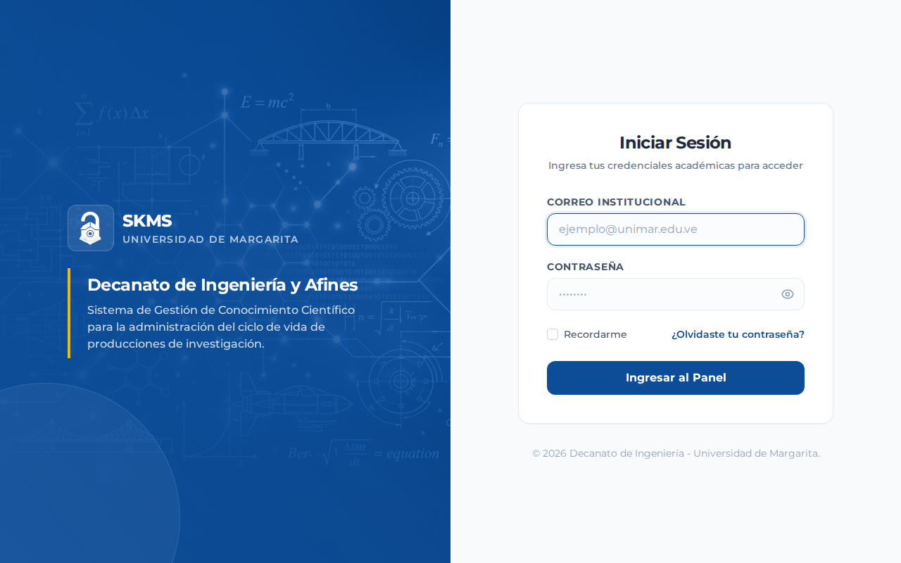

---

## 4. Guía Detallada de Procesos por Rol

---

### 4.1. Módulo del Estudiante (Investigador)

El estudiante tiene acceso a un portal dedicado para registrar sus propuestas, realizar entregas, monitorear las correcciones solicitadas por sus revisores y ver su progreso académico.

#### A. Panel Principal (Dashboard)
Al iniciar sesión, el estudiante ve de inmediato el estado de sus producciones científicas, las notificaciones pendientes y el progreso general expresado en un porcentaje estimado.

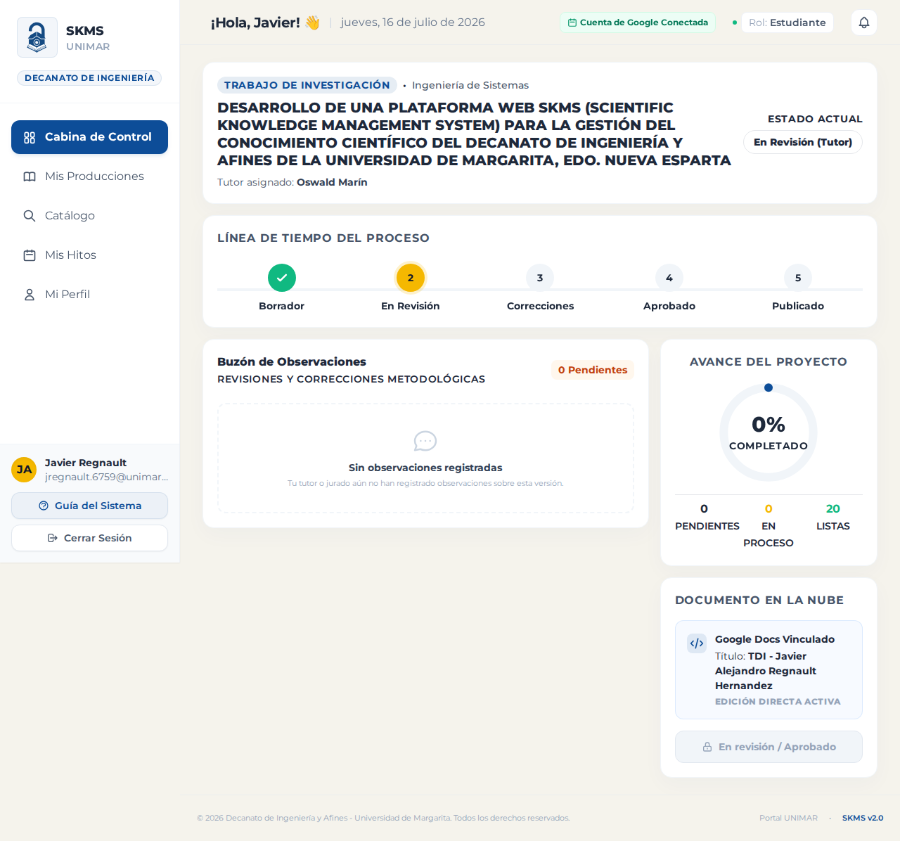

#### B. Registro de Trabajo y Metadatos Dublin Core
Para iniciar el registro de un nuevo trabajo de grado o artículo científico:
1. Vaya a **Mis Trabajos** y haga clic en **Nueva Producción**.
2. Complete el formulario con los metadatos obligatorios basados en el estándar internacional **Dublin Core (15 elementos)**:
   * **Título:** Título oficial del trabajo.
   * **Resumen:** Síntesis del contenido y resultados.
   * **Palabras Clave:** Términos de búsqueda separados por comas.
   * **Programa Académico:** Su carrera (ej. Ingeniería de Sistemas).
   * **Línea de Investigación:** Línea asociada al trabajo (ej. Inteligencia Artificial).
   * **Tipo de Producción:** Tesis de Grado o Trabajo de Investigación.
   * **Archivo PDF:** Carga obligatoria del documento de investigación con validación automática de tamaño y tipo de archivo.
3. Haga clic en **Guardar como Borrador**. Mientras el documento se encuentre en estado **Borrador**, podrá modificar los datos y el archivo cuantas veces lo necesite.

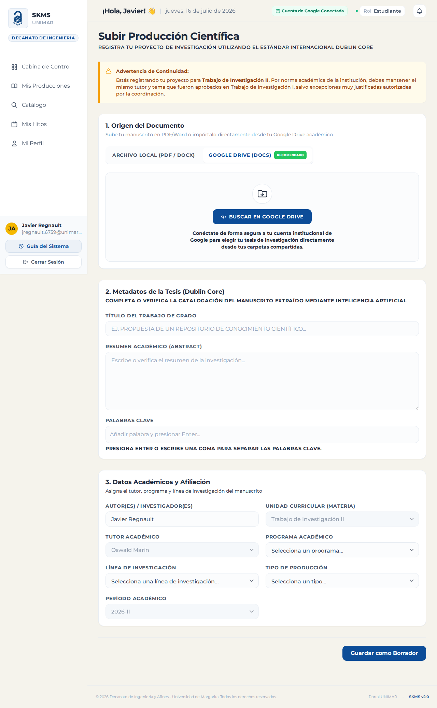

#### C. Lista de Trabajos y Envío a Revisión
Desde el listado de producciones, puede verificar el estado actual de su trabajo. Cuando el documento esté listo y cumpla con las especificaciones de su tutor, haga clic en el botón **Enviar a Revisión**. Esto cambiará el estado a **En Revisión** y bloqueará la edición del documento para el estudiante mientras el tutor lo evalúa.

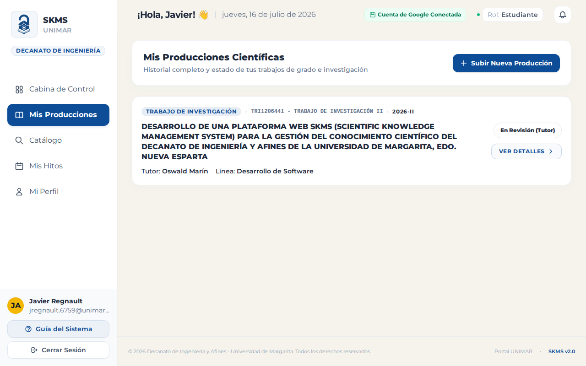

#### D. Responder Comentarios y Correcciones
Si el tutor o jurado marca el documento como **Requiere Correcciones**:
1. Recibirá una notificación en tiempo real.
2. Ingrese a la producción científica para ver el listado de observaciones organizadas por páginas o secciones.
3. Marque la corrección como *En Progreso* mientras trabaja en ella y, una vez corregida en el archivo PDF, cámbiela a *Subsanada* para que el evaluador la verifique y cierre.

---

### 4.2. Módulo del Tutor y Jurado (Revisores)

Los revisores cuentan con herramientas para auditar la calidad académica sin necesidad de descargar el archivo externamente, permitiendo un flujo de retroalimentación ágil.

#### A. Panel de Trabajos Asignados
El tutor visualiza en su dashboard las producciones científicas donde ha sido asignado. El sistema indica con alertas visuales aquellos documentos que tienen entregas pendientes por revisar.

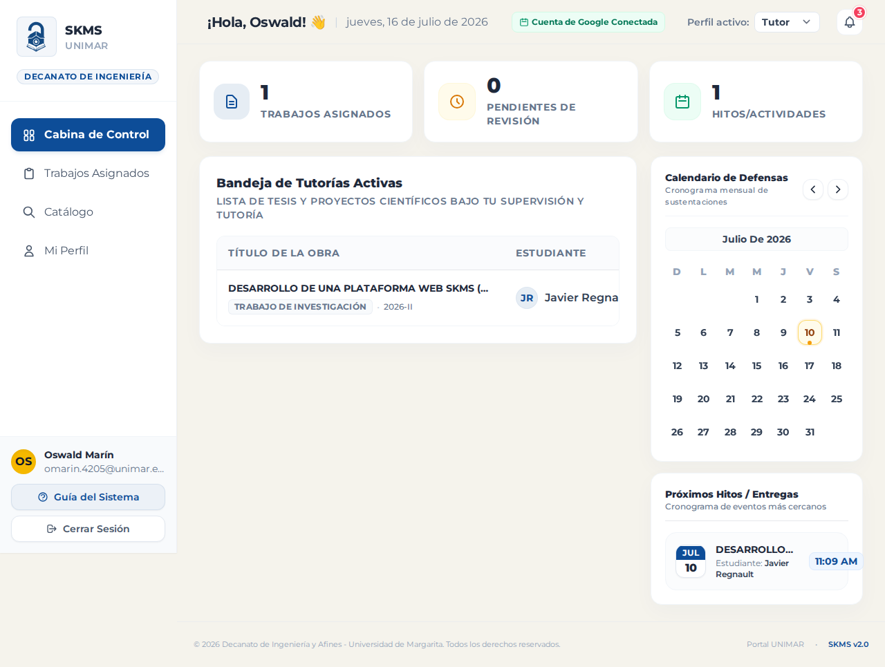

#### B. Visor PDF y Caja de Comentarios Estructurados
1. Al hacer clic en un trabajo asignado, se abre el **Visor de PDF integrado**.
2. Puede leer la tesis página por página.
3. A la derecha, dispone de un formulario para agregar comentarios vinculados a secciones específicas:
   * Indique la **Página** y **Párrafo** de referencia.
   * Redacte el contenido de la observación.
   * Guarde el comentario. El estudiante lo verá inmediatamente en su panel de progreso.

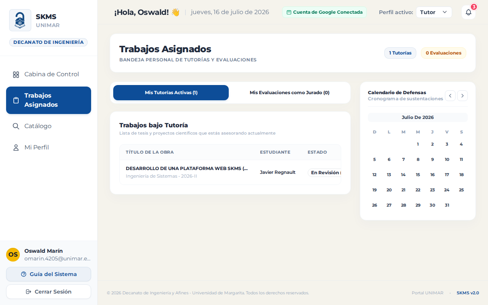

#### C. Transiciones de Estado de Evaluación
Tras evaluar la entrega, el tutor/jurado puede presionar el botón de transición para:
* **Solicitar Correcciones:** Si el documento tiene observaciones pendientes de resolver.
* **Aprobar:** Si el trabajo cumple con todos los estándares. Pasa a manos del Coordinador.
* **Rechazar:** Si el trabajo infringe normas metodológicas críticas.

---

### 4.3. Módulo del Coordinador de Investigación

El Coordinador supervisa el flujo general de trabajos del Decanato, valida los datos técnicos antes de la publicación definitiva y genera análisis macro.

#### A. Monitoreo de Progreso y Estudiantes Activos
El Coordinador puede acceder a un dashboard donde visualiza la lista de estudiantes con sus respectivos tutores asignados, estado del flujo de su tesis y el porcentaje de hitos completados.

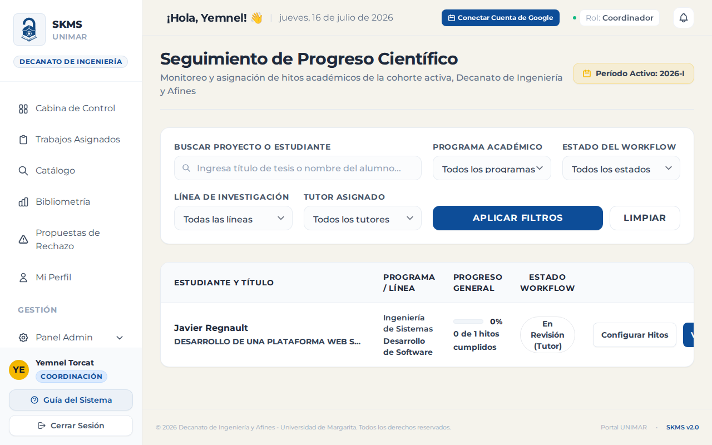

#### B. Análisis Bibliométrico
Esta sección muestra de forma visual mediante gráficos:
* Cantidad de publicaciones por año y período académico.
* Productividad por líneas de investigación y programas.
* Ranking de tutores con mayor cantidad de trabajos aprobados.

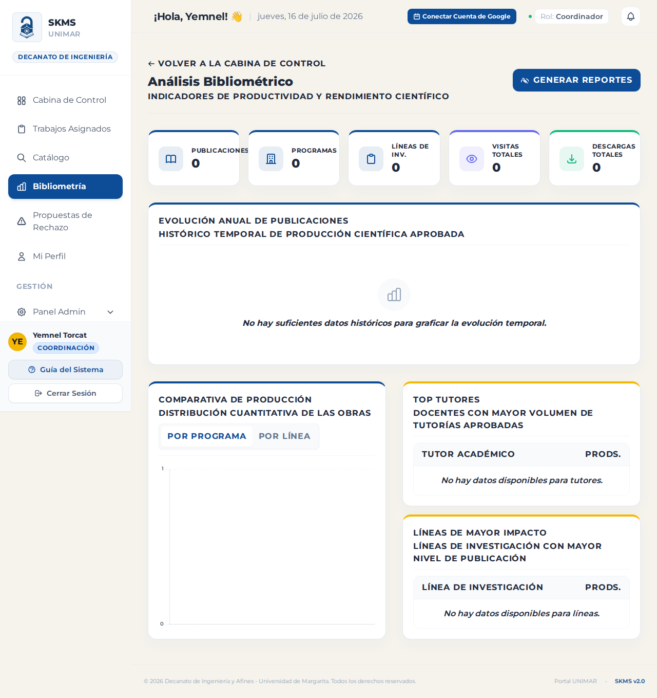

#### C. Reportes Institucionales y Descarga
El Coordinador puede generar reportes personalizados en formatos **PDF** (usando dompdf con portada institucional) y **Excel** con filtros por programa académico, periodos, tutores o estados de flujo.

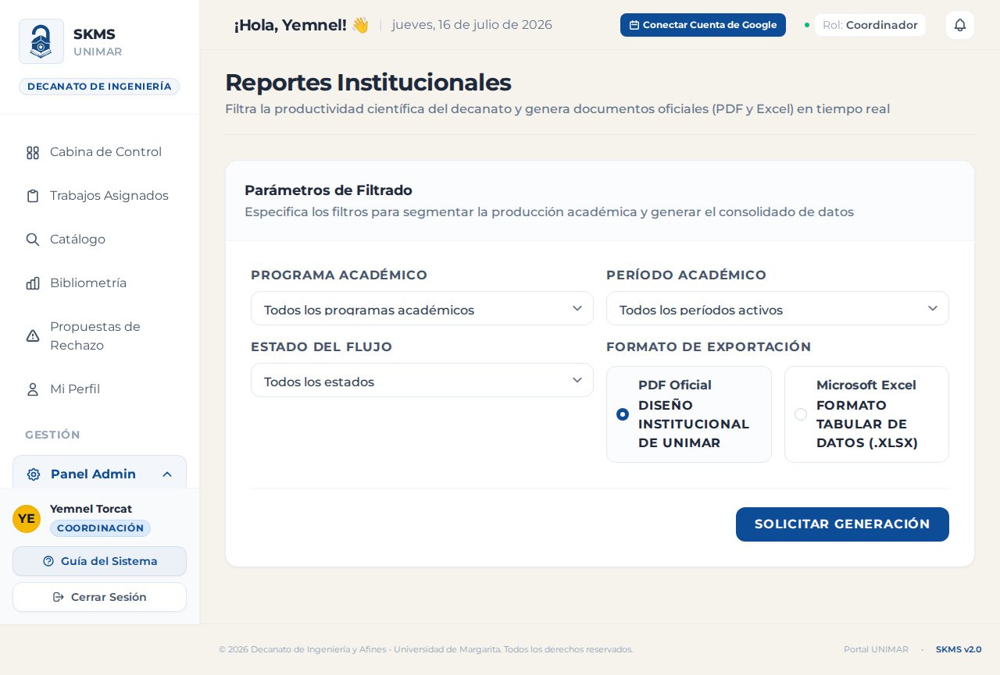

---

### 4.4. Módulo de Administración (Configuración General)

El panel administrativo permite mantener actualizados los catálogos y registrar las variables globales que definen el comportamiento de la aplicación.

#### A. Control y CRUD de Usuarios
Permite al administrador buscar, crear, editar y asignar roles específicos a los miembros de la comunidad universitaria.

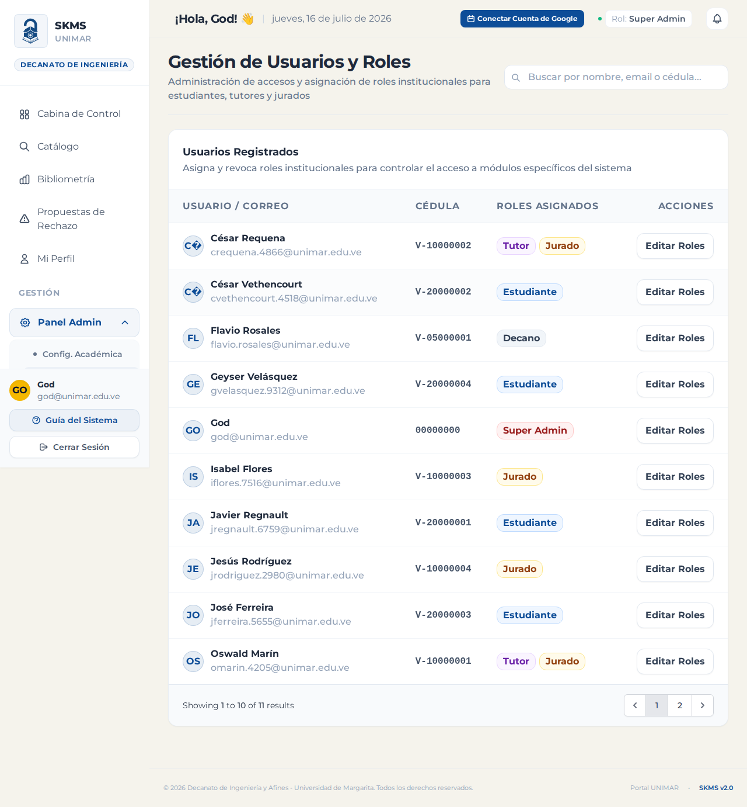

#### B. Gestión de Programas Académicos y Líneas de Investigación
CRUD para registrar las carreras (programas) dictadas en el decanato y sus respectivas líneas de investigación asociadas, facilitando la categorización de los metadatos.

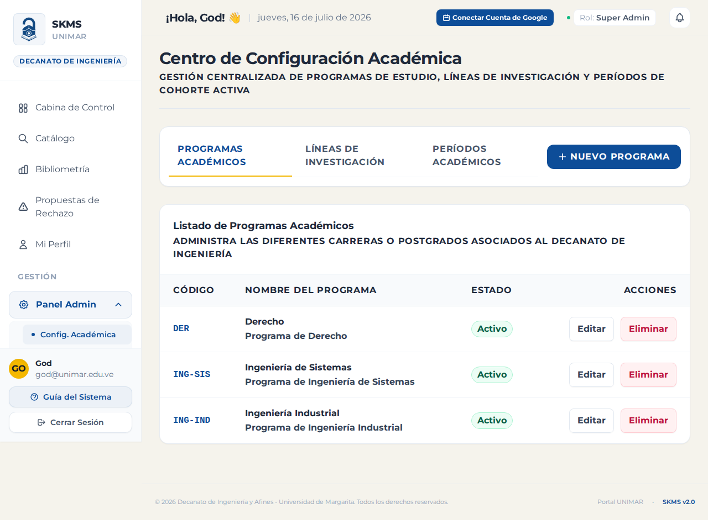

#### C. Períodos Académicos e Hitos
Configura las fechas de inicio/cierre de los semestres académicos y los hitos obligatorios del progreso de tesis (ej. Entrega de Capítulo I, Entrega de Propuesta, Pre-defensa).

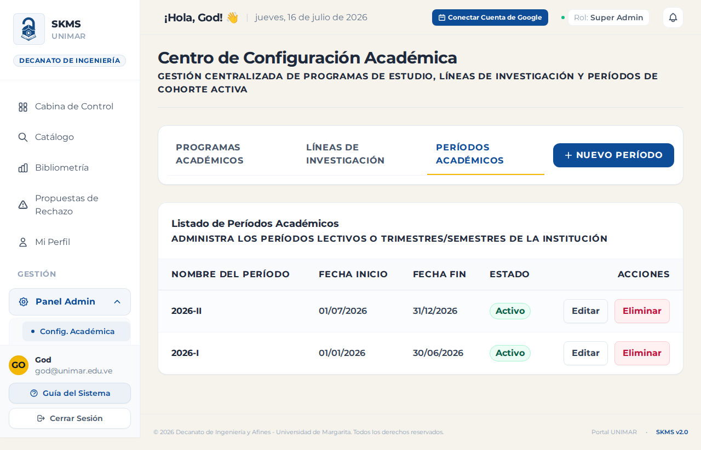

---

## 5. Interoperabilidad (OAI-PMH)

El SKMS-Unimar implementa el protocolo internacional de interoperabilidad **OAI-PMH 2.0** en el endpoint `/oai`. 

Esto permite que indexadores académicos globales (como Google Scholar, Latindex y repositorios nacionales) cosechen automáticamente las publicaciones en formato **Dublin Core XML (oai_dc)** tan pronto como el Coordinador de Investigación cambie el estado de un documento a **Publicado**.

### Formato de Metadatos
Cada registro publicado expone las etiquetas estandarizadas:
* `dc:title` - Título del trabajo.
* `dc:creator` - Estudiante/Autor.
* `dc:subject` - Línea de investigación/palabras clave.
* `dc:description` - Resumen estructurado.
* `dc:date` - Fecha de aprobación y publicación.
* `dc:type` - Tipo de producción (Tesis/Artículo).
* `dc:rights` - Licencias de uso Creative Commons especificadas.

---

## 6. Soporte y Preguntas Frecuentes (FAQ)

### ¿Cómo restauro mi contraseña?
En la pantalla de inicio de sesión, haga clic en *¿Olvidó su contraseña?*, ingrese su correo institucional y siga las instrucciones enviadas para establecer una nueva clave de acceso.

### ¿Qué tamaño máximo de archivo PDF está permitido?
El validador integrado en el formulario de carga limita los archivos a un máximo de **20 MB** para asegurar un rendimiento óptimo en conexiones de banda reducida.

### ¿Cómo cambio mi rol de Tutor a Jurado si tengo ambos perfiles?
En la barra superior de navegación, el sistema le mostrará un selector llamado **"Perfil activo"** en donde podrá intercambiar su rol de forma instantánea sin necesidad de cerrar sesión.
